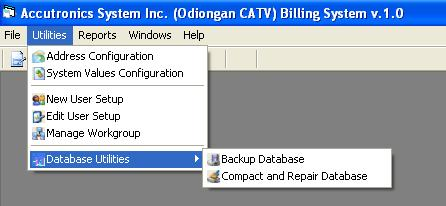



## icon in menus

### Description

WANT TO PUT ICONS IN YOUR MENUS? THIS IS ONE OF THE MOST COMMON PROBLEMS BEGINNER OR EVEN INTERMEDIATE PROGRAMMERS WANTED TO SOLVE. NOW, HERE'S THE EXACT ANSWER TO YOUR PROBLEMS. I SHARE WITH YOU HOW TO PUT ICONS IN YOUR MENUS IN THE SIMPLEST WAY, FEW LINES OF CODES AND 1 FORM ILUSTRATION. RATE ME.
 
### More Info
 
STILL HAVING PROBLEM IN THIS CODE, EMAIL ME.

             |
---                |---
**Submitted On**   |2006-07-12 02:20:02
**By**             |[Ressie S\. Fos](https://github.com/Planet-Source-Code/PSCIndex/blob/master/ByAuthor/ressie-s-fos.md)
**Level**          |Advanced
**User Rating**    |4.9 (74 globes from 15 users)
**Compatibility**  |VB 6\.0
**Category**       |[Data Structures](https://github.com/Planet-Source-Code/PSCIndex/blob/master/ByCategory/data-structures__1-33.md)
**World**          |[Visual Basic](https://github.com/Planet-Source-Code/PSCIndex/blob/master/ByWorld/visual-basic.md)
**Archive File**   |[icon\_in\_me2005807112006\.zip](https://github.com/Planet-Source-Code/ressie-s-fos-icon-in-menus__1-65928/archive/master.zip)

